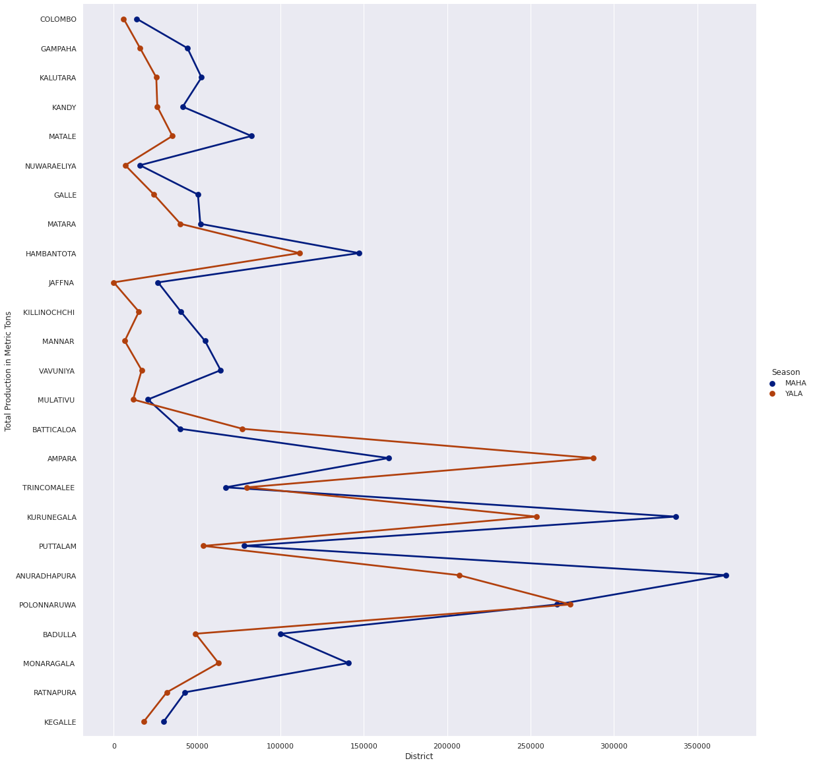
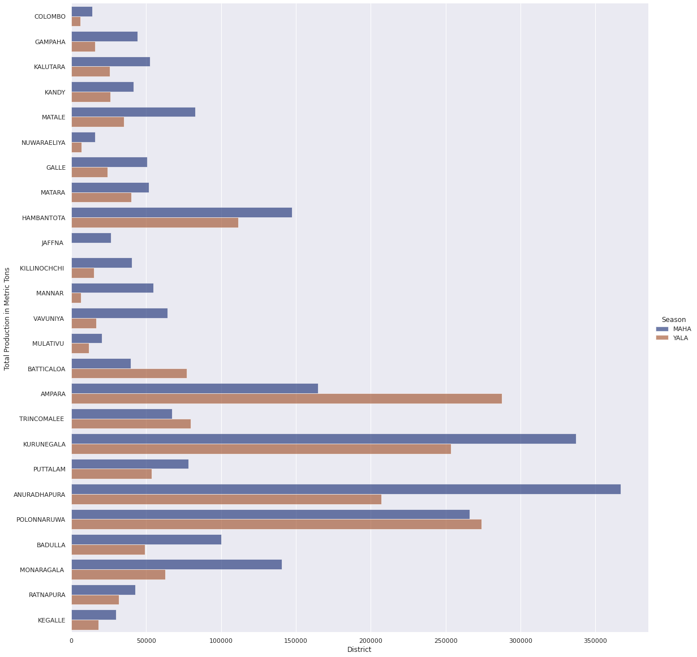
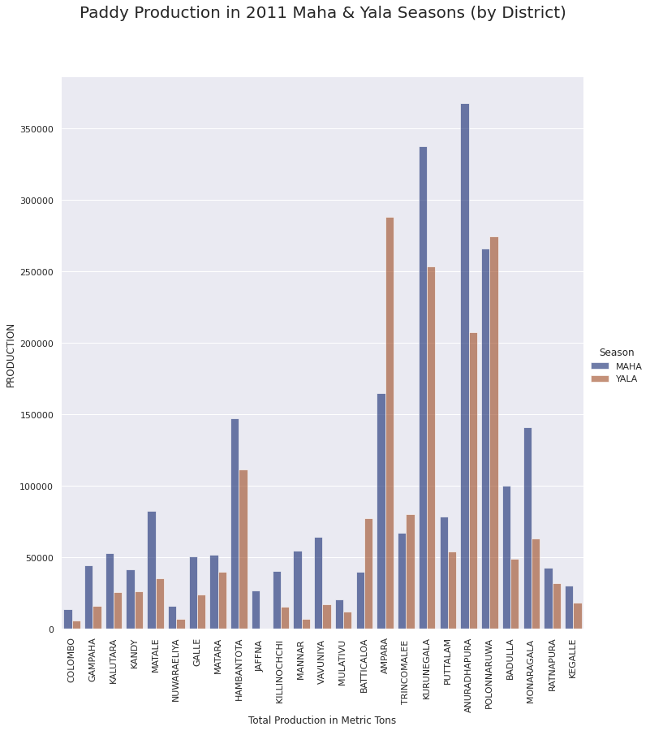
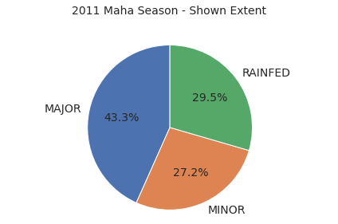
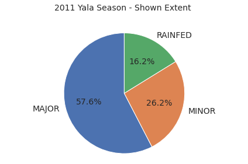
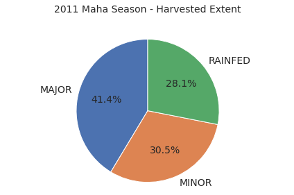
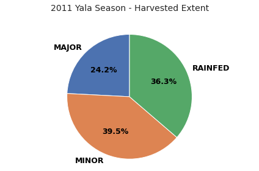
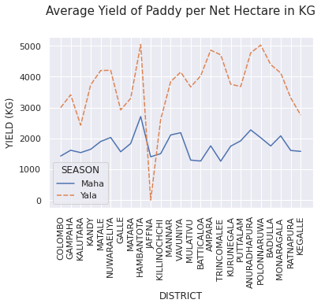
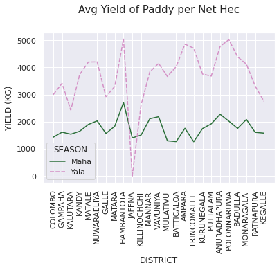
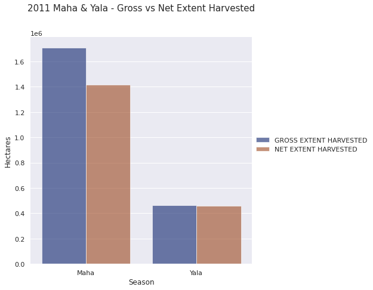

```python
# Install & Import Libraries
!pip install numpy
!pip install pandas
!pip install seaborn
!pip install matplotlib

import seaborn as sea
import pandas as pd
sea.set_theme(style="darkgrid")
import matplotlib.pyplot as plot
%matplotlib inline
```

    Requirement already satisfied: numpy in ./lib/python3.8/site-packages (1.19.5)
    Requirement already satisfied: pandas in ./lib/python3.8/site-packages (1.2.0)
    Requirement already satisfied: numpy>=1.16.5 in ./lib/python3.8/site-packages (from pandas) (1.19.5)
    Requirement already satisfied: python-dateutil>=2.7.3 in ./lib/python3.8/site-packages (from pandas) (2.8.1)
    Requirement already satisfied: pytz>=2017.3 in ./lib/python3.8/site-packages (from pandas) (2020.5)
    Requirement already satisfied: six>=1.5 in ./lib/python3.8/site-packages (from python-dateutil>=2.7.3->pandas) (1.15.0)
    Requirement already satisfied: seaborn in ./lib/python3.8/site-packages (0.11.1)
    Requirement already satisfied: numpy>=1.15 in ./lib/python3.8/site-packages (from seaborn) (1.19.5)
    Requirement already satisfied: pandas>=0.23 in ./lib/python3.8/site-packages (from seaborn) (1.2.0)
    Requirement already satisfied: matplotlib>=2.2 in ./lib/python3.8/site-packages (from seaborn) (3.3.3)
    Requirement already satisfied: scipy>=1.0 in ./lib/python3.8/site-packages (from seaborn) (1.6.0)
    Requirement already satisfied: python-dateutil>=2.1 in ./lib/python3.8/site-packages (from matplotlib>=2.2->seaborn) (2.8.1)
    Requirement already satisfied: cycler>=0.10 in ./lib/python3.8/site-packages (from matplotlib>=2.2->seaborn) (0.10.0)
    Requirement already satisfied: pyparsing!=2.0.4,!=2.1.2,!=2.1.6,>=2.0.3 in ./lib/python3.8/site-packages (from matplotlib>=2.2->seaborn) (2.4.7)
    Requirement already satisfied: pillow>=6.2.0 in ./lib/python3.8/site-packages (from matplotlib>=2.2->seaborn) (8.1.0)
    Requirement already satisfied: kiwisolver>=1.0.1 in ./lib/python3.8/site-packages (from matplotlib>=2.2->seaborn) (1.3.1)
    Requirement already satisfied: six in ./lib/python3.8/site-packages (from cycler>=0.10->matplotlib>=2.2->seaborn) (1.15.0)
    Requirement already satisfied: pytz>=2017.3 in ./lib/python3.8/site-packages (from pandas>=0.23->seaborn) (2020.5)
    Requirement already satisfied: matplotlib in ./lib/python3.8/site-packages (3.3.3)
    Requirement already satisfied: cycler>=0.10 in ./lib/python3.8/site-packages (from matplotlib) (0.10.0)
    Requirement already satisfied: kiwisolver>=1.0.1 in ./lib/python3.8/site-packages (from matplotlib) (1.3.1)
    Requirement already satisfied: pyparsing!=2.0.4,!=2.1.2,!=2.1.6,>=2.0.3 in ./lib/python3.8/site-packages (from matplotlib) (2.4.7)
    Requirement already satisfied: numpy>=1.15 in ./lib/python3.8/site-packages (from matplotlib) (1.19.5)
    Requirement already satisfied: python-dateutil>=2.1 in ./lib/python3.8/site-packages (from matplotlib) (2.8.1)
    Requirement already satisfied: pillow>=6.2.0 in ./lib/python3.8/site-packages (from matplotlib) (8.1.0)
    Requirement already satisfied: six in ./lib/python3.8/site-packages (from cycler>=0.10->matplotlib) (1.15.0)


```python
# Importing CSV files

yala = pd.read_csv('/home/nuwant/code/yalaMaha/yalaMaha/CSVfiles/yala.csv')

maha = pd.read_csv('/home/nuwant/code/yalaMaha/yalaMaha/CSVfiles/maha.csv')
```


```python
#Create data frames

maha =maha.loc[(maha['DISTRICT'] != "UDAWALAWE")]

maha = maha.loc[(maha['DISTRICT'] != "MAHAWELI")]

yala = yala.loc[(yala['DISTRICT'] != "UDA WALAWE")]

yala = yala.loc[(yala['DISTRICT'] != "MAHAWELI 'H'")]
```


```python
#Group Bar Chart for Paddy Production by District

production_m = pd.DataFrame(columns=['DISTRICT','SEASON','PRODUCTION'])

production_m['DISTRICT'] = maha['DISTRICT'].values

production_m['SEASON'] = "MAHA"

production_m['PRODUCTION'] = maha[' TOTAL PRODUCTION in MT'].values
```


```python
production_y = pd.DataFrame(columns=['DISTRICT','SEASON','PRODUCTION'])

production_y['DISTRICT'] = yala['DISTRICT'].values

production_y['SEASON'] = "YALA"

production_y['PRODUCTION'] = yala['TOTAL PRODUCTION'].values
```


```python
# Merging Dataframes and Plot the graph

production = pd.concat([production_m,production_y])


prod = sea.catplot(
    data=production, kind="point",
    x="PRODUCTION", y="DISTRICT", hue="SEASON",
    ci="sd", palette="dark", alpha=.6, height=16
)

prod.despine(left=True)

prod.set_axis_labels("District", "Total Production in Metric Tons")

prod.legend.set_title("Season")
```


    

    


```python
# Merging Dataframes and Plot the graph

production = pd.concat([production_m,production_y])


prod = sea.catplot(
    data=production, kind="bar",
    x="PRODUCTION", y="DISTRICT", hue="SEASON",
    ci="sd", palette="dark", alpha=.6, height=16
)

prod.despine(left=True)

prod.set_axis_labels("District", "Total Production in Metric Tons")

prod.legend.set_title("Season")
```


    

    


```python
prod = sea.catplot(
    data=production, kind="bar",
    x="DISTRICT", y="PRODUCTION", hue="SEASON",
    ci="sd", palette="dark", alpha=.6, height=10
)

prod.despine(left=True)

prod.set_axis_labels("Total Production in Metric Tons")

prod.legend.set_title("Season")

prod.set_xticklabels(rotation=90)

import matplotlib.pyplot as plt

plt.title('Paddy Production in 2011 Maha & Yala Seasons (by District)', fontsize = 20, y = 1.1)
```


    Text(0.5, 1.1, 'Paddy Production in 2011 Maha & Yala Seasons (by District)')


    

    


```python
data = [['MAJOR', maha.iloc[:,1].sum()], ['MINOR', maha.iloc[:,2].sum()], ['RAINFED', maha.iloc[:,3].sum()]]

se_m = pd.DataFrame(data, columns = ['Type', 'Hectares']) 
# Pie chart
labels = se_m["Type"]

sizes = se_m['Hectares']

pie1, ax1 = plt.subplots()

ax1.pie(sizes, labels=labels, autopct='%1.1f%%',
        shadow=False, startangle=90, textprops={'fontsize':14})

ax1.set_title('2011 Maha Season - Shown Extent', fontdict={'fontsize': 14}, y=1.1)

ax1.axis('equal')  

plt.tight_layout()
```


    

    


```python
data = [['MAJOR', yala.iloc[:,1].sum()], ['MINOR', yala.iloc[:,2].sum()], ['RAINFED', yala.iloc[:,3].sum()]]

se_y = pd.DataFrame(data, columns = ['Type', 'Hectares']) 

labels = se_y["Type"]

sizes = se_y['Hectares']

pie2, ax2 = plt.subplots()

ax2.pie(sizes, labels=labels, autopct='%1.1f%%',
        shadow=False, startangle=90, textprops={'fontsize':14})

ax2.set_title('2011 Yala Season - Shown Extent ', fontdict={'fontsize': 14}, y=1.1)


ax2.axis('equal')  

plt.tight_layout()
```


    

    


```python
data = [['MAJOR', maha.iloc[:,5].sum()], ['MINOR', maha.iloc[:,6].sum()], ['RAINFED', maha.iloc[:,7].sum()]]

he_m = pd.DataFrame(data, columns = ['Type', 'Hectares']) 

labels = he_m["Type"]

sizes = he_m['Hectares']

pie3, ax3 = plt.subplots()

ax3.pie(sizes, labels=labels, autopct='%1.1f%%',
        shadow=False, startangle=90, textprops={'fontsize':14})

ax3.set_title('2011 Maha Season - Harvested Extent', fontdict={'fontsize': 14}, y=1.1)

ax3.axis('equal')  

plt.tight_layout()
```


    

    


```python
data = [['MAJOR', yala.iloc[:,5].sum()], ['MINOR', maha.iloc[:,6].sum()], ['RAINFED', maha.iloc[:,7].sum()]]

he_y = pd.DataFrame(data, columns = ['Type', 'Hectares']) 

labels = he_y["Type"]

sizes = he_y['Hectares']

pie4, ax4 = plt.subplots()

ax4.pie(sizes, labels=labels, autopct='%1.1f%%',
        shadow=False, startangle=90, textprops={'color':"black", 'weight':'bold', 'fontsize':12.5})

ax4.set_title('2011 Yala Season - Harvested Extent', fontdict={'fontsize': 14}, y=1.1)

ax4.axis('equal')  

plt.tight_layout()
```


    

    


```python
m_y = pd.DataFrame(columns=['DISTRICT','SEASON','YIELD (KG)'])

m_y['DISTRICT'] = maha['DISTRICT'].values

m_y['SEASON'] = "Maha"

m_y['YIELD (KG)'] = maha['AVERAGE YIELD PER NETT HECTARE (Kg.) AVERAGE YIELD'].values

y_y = pd.DataFrame(columns=['DISTRICT','SEASON','YIELD (KG)'])

y_y['DISTRICT'] = yala['DISTRICT'].values

y_y['SEASON'] = "Yala"

y_y['YIELD (KG)'] = yala['AVERAGE YIELD PER NETT HECTARE (Kg.) AVERAGE YIELD'].values

a_yield = pd.concat([m_y, y_y])


yield1 =sea.lineplot(data=a_yield,
             x="DISTRICT",
             y="YIELD (KG)",
             hue="SEASON", style="SEASON")

plt.setp(yield1.get_xticklabels(), rotation=90)

import matplotlib.pyplot as plt

plt.title('Average Yield of Paddy per Net Hectare in KG', fontsize = 15, y = 1.1)
```


    Text(0.5, 1.1, 'Average Yield of Paddy per Net Hectare in KG')


    

    


```python
a_yield = pd.concat([m_y, y_y])

yield1 =sea.lineplot(data=a_yield,
             x="DISTRICT",
             y="YIELD (KG)",
             hue="SEASON", style="SEASON",palette="cubehelix")
sea.color_palette("Paired")

plt.setp(yield1.get_xticklabels(), rotation=90)

import matplotlib.pyplot as plt

plt.title('Avg Yield of Paddy per Net Hec', fontsize = 15, y = 1.1)

data1 = [["Maha", 'GROSS EXTENT HARVESTED', maha.iloc[:,4].sum()], ['Maha','NET EXTENT HARVESTED', maha.iloc[:,8].sum()],
         ['Yala', 'GROSS EXTENT HARVESTED', yala.iloc[:,4].sum()], ['Yala', 'NET EXTENT HARVESTED', yala.iloc[:,8].sum()]]


harvest = pd.DataFrame(data1, columns = ['Season','Type', 'Hectares']) 

#Make the grapgh

prod = sea.catplot(
    data=harvest, kind="bar",
    x="Season", y="Hectares", hue="Type",
    ci="sd", palette="dark", alpha=.6, height=6
)

prod.despine(left=True)

prod.set_axis_labels("Season", "Hectares")

prod.legend.set_title("")

prod.set_xticklabels(rotation=0)

import matplotlib.pyplot as plt

plt.title('2011 Maha & Yala - Gross vs Net Extent Harvested', fontsize = 15, y = 1.1)
```


    Text(0.5, 1.1, '2011 Maha & Yala - Gross vs Net Extent Harvested')


    

    


    

    


```python

```


```python

```


```python

```
